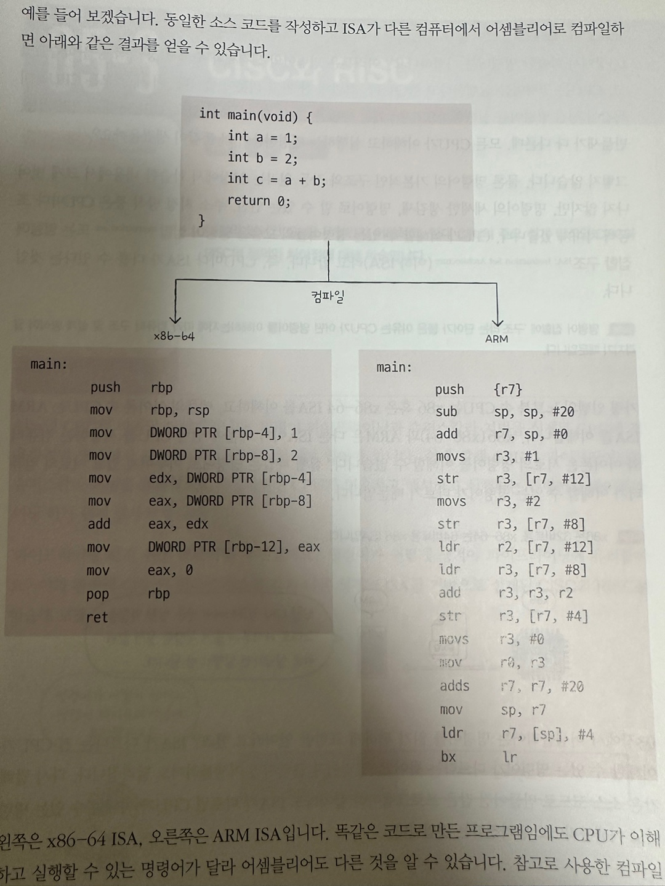
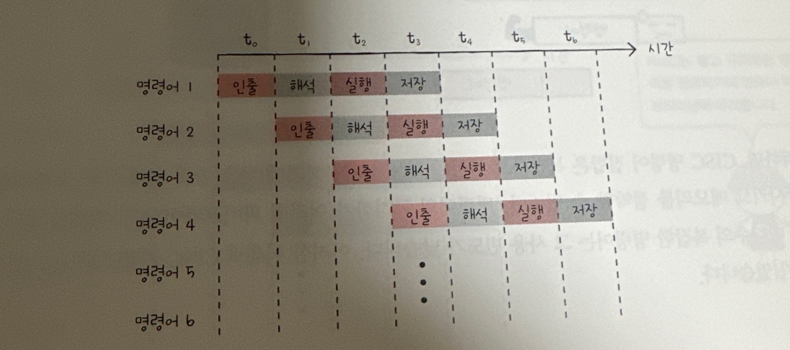
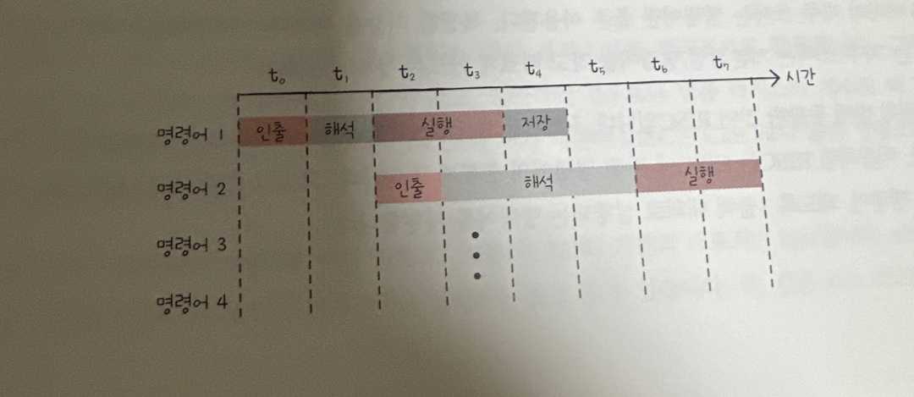
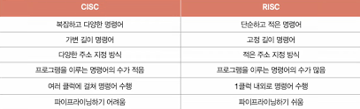

# CISC와 RISC

CPU가 이해할 수 있는 명령어 집합을 ISA라고 합니다.

x86, x86-64, ARM 등 CPU마다 ISA는 다를 수 있습니다.

동일한 코드를 작성해도 다른 컴퓨터에서 어셈블리어로 컴파일 하는 경우 다른 결과를 얻을 수 있습니다.

ISA가 같은 CPU끼리는 서로의 명령어를 이해할 수 있지만, 다른 경우 이해할 수 없습니다.

이러한 차이는 어샘블리어의 생김세만 다른 것이 아니라, 제어장치가 명령어를 해석하는 방식, 사용되는 레지스터의 종류와 개수, 메모리 관리 방법 등 많은 것이 달라집니다.

앞서 학습한 명령어 병렬처리에 유리한 ISA가 CISC와 RISC 두가지가 있습니다.

### CISC

복잡한 명령어 집합을 활용하는 컴퓨터를 의미합니다.

명령어의 형태와 크기가 다양한 가변 길이 명령어를 활용합니다.

이러한 점은 적은 수의 명령어로도 프로그램을 실행할 수 있음을 의미합니다.

- 위 코드 이미지의 ARM 보다 x86-64가 더 짧은 것이 더 적은 명령어로 수행할 수 있음을 의미합니다.

단점은 활용하는 명령어가 복잡하고 다양한 기능을 제공하여 명령어의 크기와 실행되기까지의 시간이 일정하지 않다는점 입니다. 이는 파이프라인을 구현하는데 걸림돌이 됩니다.

위 두 사진을 비교해보면 첫번째 사진의 경우 1클럭으로 동일하게 동작하고 있으나, 아래 사진은 가지각색이기 때문에 효율적으로 파이프라이닝을 할 수 없습니다.

또한 대다수의 복잡한 명령어는 그 사용 빈도가 낮아 효율적이지 못합니다.

### RISC

빠른 처리를 위해 명령어 파이프라인을 활용해야한다. 원활한 파이프라인을 위해서는 명령어 길이와 수행 시간이 짧고 규격화 되어야한다.

복잡한 명령어는 잘 사용되지 않는다. 따라서 자주 쓰이는 기본적인 명령어를 작고 빠르게 만드는 것이 중요하다.

RISC는 위와 같은 CISC의 한계를 극복한 특징을 가지고 있습니다.

1. 명령어 종류가 적다.
2. 짧고 구격화되어 있으며, 되도록 1클럭 내외로 실행하는 명령어를 지향한다.

RISC는 이를 위해 **고정 길이 명령어**를 사용합니다.

또한 메모리 접근을 단순화 하고 최소화를 추구합니다.

이를 위해 레지스터를 접극적으로 활용하여, CISC보다 레지스터를 이용한 연산이 많고, 범용 레지스터 개수도 더 많습니다.

