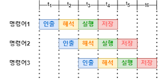
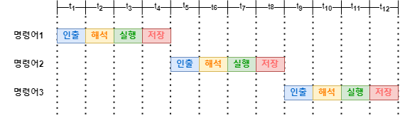
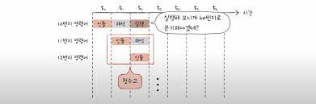
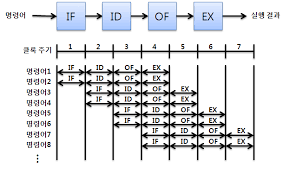
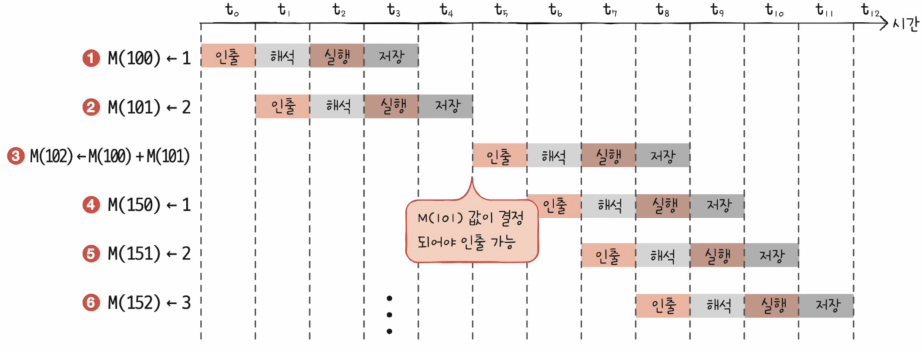
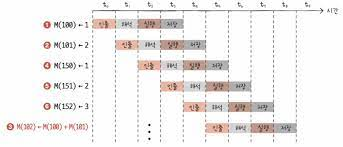

# 명령어 병렬 처리 기법

### 핵심 키워드

명령어 파이프라이닝

슈퍼 스칼라

비순차적 명령어 처리

### CPU가 놀지 않고 시간을 알뜰하게 쓰게 작동하게 하는 법

**명령어 파이프라인**

명령어 처리 과정을 클럭 단위로 나눠서 보자면

1. 명령어 인출
2. 명령어 해석
3. 명령어 실행
4. 결과 저장

각 단계는 겹치지만 않으면 동시에 실행할 수 있습니다.

인출하는 동안에 다른 명령어를 실행하거나 해석할 수 있고, 실행되는 동안에 저장될 수 있습니다.

만약 명령어 파이프라인을 사용하지 않고 순차적으로 진행한다면

이 그림과 같이 동작할 것입니다.

파이프라이닝은 높은 성능을 가져오긴 하지만 위험도 가지고 있습니다.

파이프라인 위험에는

1. 데이터 위험
2. 제어 위험
3. 구조적 위험

데이터 위험은 명령어 간에 데이터 의존성에 의해서 발생합니다.

명령어 1을 수행해야만 명령어 2를 수행할 수 있는 경우, 명령어 1이 끝나기 전 명령어2를 수행하려하는 경우 파이프라인이 제대로 작동하지 않습니다. 

제어 위험은 프로그램 카운터의 갑작스런 변화에 의해 발생합니다.

위 이미지와 같이 명령어가 실행되면서 갑자기 프로그램 카운터에 변화가 생기면, 미리 가지고 와서 처리 중인 작업이 쓸모가 없어집니다.

분기나 점프 같은 제어 명령어가 수행될때 위와 같은 상황이 발생합니다.

분기나 점프란?

분기 = 조건문, 루프제어, 오류처리 등

점프 = 함수 호출과 반환, 특정 코드 위치로 이동 등

구조적 위험은 명령어를 겹서 실행하는 과정에서 서로 다른 명령어가 동시에 CPU 부품을 사용하려는 경우 발생합니다.

**슈퍼스칼라**

파이프라이닝을 여러개로 이용하는 기술 

위 이미지는 파이프라이닝을 2개 해서 2가지 동작을 한번에 사용하고 있습니다.

**비순차적 명령어 처리**

의존성이 없는 동작을 합법적으로 새치기하는 것을 의미합니다.

3번은 2번에 의존적이여서 2번이 저장될때 까지 기다려야하는 상황이 발생했습니다.

3번을 제일 마지막에 실행하여 효율적으로 처리되게 수정할 수 있습니다.