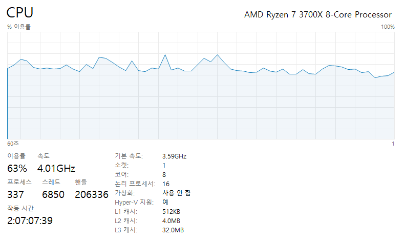
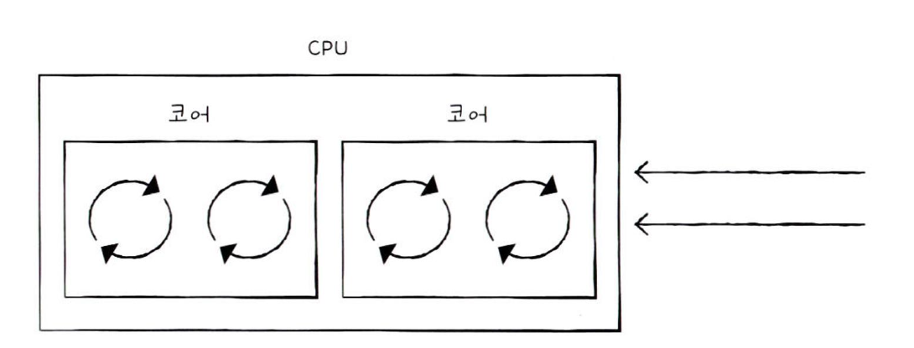
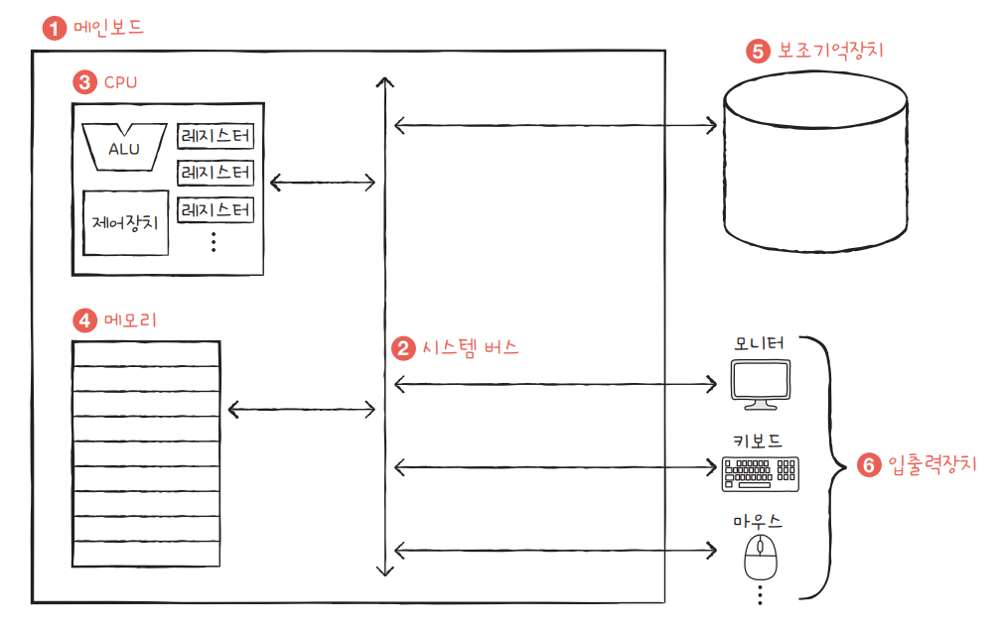
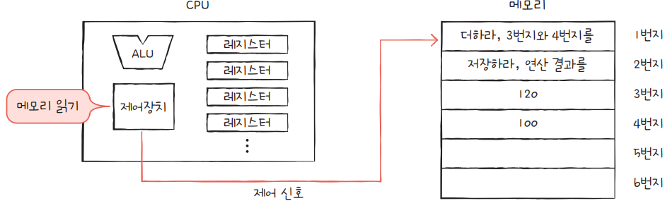

# 빠른 CPU를 위한 설계법

### 핵심 키워드

- 클럭
- 멀티스레드
- 코어
- 스레드
- 멀티코어

### 빠른 CPU를 설계하려면 어떻게 해야할까?

1. 컴퓨터 부품들은 클럭 신호에 맞춰 일사분란하게 움직인다.
2. CPU는 명령 사이클 이라는 정해진 흐름에 맞춰 명령어들을 실행한다.

따라서 클럭 신호가 빠르게 반복되면, 부품들이 빠른 박자에 맞춰서 움직이게 됩니다.

### 클럭

클럭의 단위는 Hz로 측정합니다. 1초에 몇 번 신호가 반복되는지를 나타냅니다.

- 4.01GHz 의 속도라는 건 1초에 40억번 반복된다는 것을 의미합니다.

**그렇다면 클럭속도를 무한정 높이면 무조건 CPU가 빨라질까요?**

CPU의 발열로 인해 클럭속도를 높이는 방법은 한계가 있습니다.

이를 해결하기 위한 방법으로 코어 수와 스레드 수를 늘릴 수 있습니다.

### 코어와 멀티스레드

코어는 명령어를 실행하는 부품입니다.

이러한 코어를 여러 개 포함하고 있는 CPU를 **멀티코어, 멀티코어 프로세서**라고 합니다.

대체로 싱글코어 2.4GHz 보다 듀얼코어 1.9GHz가 일을 더 잘합니다. 

그러나 4코어 8코어 계속해서 코어 수가 늘어난다고해서 이 방법도 무한정 성능이 좋아지진 않습니다.

### 스레드와 멀티스레드

스레드는 실행 흐름의 단위입니다.

스레드는 **하드웨어적 스레드, 소프트웨어적 스레드** 두가지 의미가 있습니다.

**하드웨어적 스레드**

- 하나의 코어가 동시에 처리하는 명령어 단위

2코어 4스레드의 CPU 이미지

위 사진과 같이 생긴 CPU를 멀티스레드 프로세서 혹은 멀티 스레드 CPU 라고 합니다.

`하이퍼 스레딩 : 인텔의 기술로 코어를 가상적으로 늘려주는 기술을 의미한다.`

**소프트웨어적 스레드**

- 하나의 프로그램에서 독립적으로 실행되는 단위

하나의 프로그램은 실행되는 과정에서 한 부분만 실행될 수도 있지만, 프로그램의 여러 부분이 동시에 실행될 수도 있습니다.

워드 프로세서 프로그램을 가정하여

1. 입력 받은 내용을 화면에 보여주는 기능
2. 입력한 맞춤법을 검사하는 기능
3. 입력한 내용을 수시로 저장하는 기능

각 기능을 개별 스레드로 만들어 동시에 실행할 수 있습니다.

### 멀티스레드 프로세서

멀티스레드 프로세서의 가장 큰 핵심은 레지스터입니다.

레지스터는 프로그램 카운터, 스택 포인터, 메모리 버퍼 레지스터, 메모리 주소 레지스터와 같이 하나의 명령어를 처리하기 위해 꼭 필요한 레지스터를 여러 개 가지고 있으면 됩니다. 이를 통해 여러 개의 명령어 주소, 여러 개의 스택을 관리할 수 있기 때문입니다. 

- 앞서 보았던 메인보드 구조

- 다수의 레지스터 구조

2코어 4스레드의 CPU의 경우,

한번에 네개의 명령어를 처리할 수있어, 프로그램입장에서 보았을때 CPU가 네개 있는 것 처럼 보입니다. 그래서 하드웨어의 스레드를 논리프로세서라고도 합니다.

8코어 16스레드의 CPU의 경우 아래와 같이 명시되어있는 걸 볼 수 있습니다.

