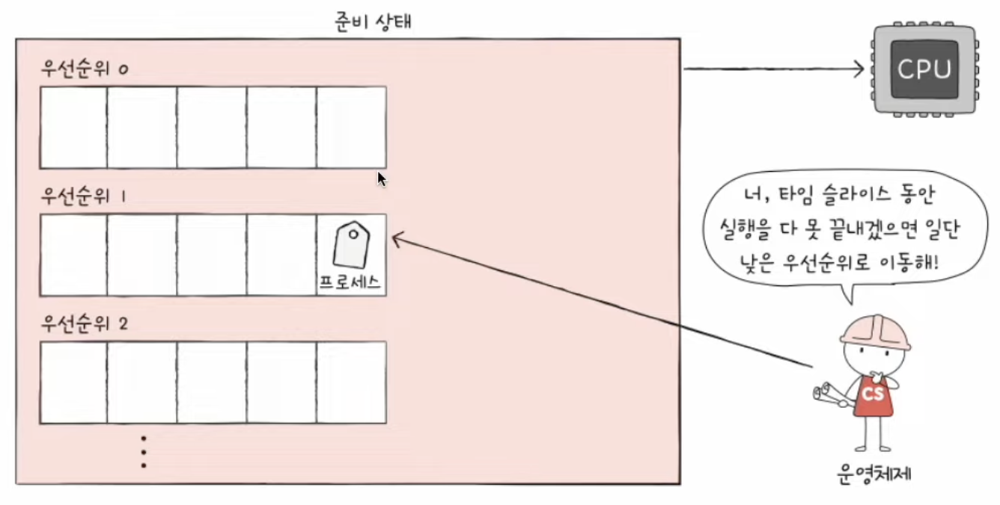

# CPU 스케줄링

모든 프로세스는 CPU를 필요로 하고 모든 프로세스는 CPU를 먼저 사용하고 싶어한다.

이러한 프로세스들에 공정하고 합리적으로 CPU 자원을 배분하는 것을 CPU 스케줄링이라고 한다.

### 프로세스 우선순위

프로세스 마다 우선순위가 다르고, 우선순위가 높은 프로세스는 빠르게 처리되어야 하는 프로세스이다. 대표적으로 입출력이 많은 프로세스가 우선순위가 높다.

왜 입출력이 많은 프로세스가 우선순위가 높을까?

대부분의 프로세스는 CPU와 입출력 장치 모두를 사용하며 실행된다.

이는 대기상태와 실행상태를 반복하며 실행됨을 의미한다.


**입출력 집중 프로세스**

ex) 비디오 재생, 디스크 백업 작업

**CPU 집중 프로세스**

ex) 복잡한 수학연산, 컴파일 그래픽 처리작업

CPU 집중 프로세스와 입출력 집중 프로세스가 동일한 빈도로 CPU를 사용하는 것은 비합리적이다.

입출력 집중 프로세스를 가능한 빨리 실행시켜 입출력장치를 끊임없이 작동시키고, CPU 집중 프로세스에 집중적으로 CPU를 할당하는 것이 더 효율적이다. 입출력장치는 대기시간이 위 사진처럼 대기시간이 있기때문이다.

상황에 맞게, 프로세스 중요도에 맞게 각 운영체제는 프로세스마다 **우선순위**를 부여한다.

- 리눅스


```tsx
F: 프로세스의 플래그 (예: 스케줄러 정보, 프로세스 상태 등)
S: 프로세스의 상태 (예: R (running), S (sleeping), Z (zombie))
UID: 프로세스를 실행하는 사용자의 ID
PID: 프로세스 ID
PPID: 부모 프로세스 ID
C: CPU 사용률을 나타내는 스케줄러 우선순위
PRI: 프로세스의 스케줄링 우선순위
NI: Nice 값 (다른 프로세스에 비해 CPU 시간을 얼마나 덜 사용할지를 결정하는 값)
ADDR: 프로세스의 메모리 주소
SZ: 프로세스가 사용하는 메모리의 크기
WCHAN: 프로세스가 대기 중인 이벤트
TTY: 프로세스가 연결된 터미널
TIME: CPU 시간
CMD: 실행 중인 명령
```

- 윈도우


### 스케줄링 큐

PCB에 우선순위가 적혀있긴 하지만, CPU를 사용할 다음 프로세스를 찾기 위해 모든 프로세스의 PCB를 뒤적거리는 것은 비효율적이다.

그래서 운영체재는 프로세스들에 줄서서 기다릴 것을 요구한다.

이 줄을 **스케줄링 큐**로 구현하고 관리한다.

운영체재는 각 프로세스들을 원하는 동작에 맞게 큐를 세워서 관리한다.


대표적인 큐로는 대기큐와 준비큐가 있다.

대기큐는 입출력 장치를 이용하기 위해 대기상태에 접어든 프로세스들이 서는 줄이다.

준비큐는 cpu를 이용하고 싶은 프로세스들이 서는 줄이다.

우선순위가 낮은 프로세스들이 먼저 큐에 삽입되어 줄을 섰다고 할지라도 우선순위가 높은 프로세스가 먼저 처리될 수 있다.


### 선점형 비선점형 스케줄링

갑자기 다른 급한 프로세스가 지금 당장 CPU 사용을 요청한다면?

1. 지금 사용중인 프로세스로 부터 빼앗아 할당하기
2. 프로세스 작업이 끝날때까지 급한 프로세스를 대기

선점형 스케줄링은 이러한 경우 1번과 같이 자원을 빼앗아 다른 프로세스에 할당하는 스케줄링 방식이다. 이는 하나의 프로세스가 자원 사용을 독점할 수 없는 스케줄링 방식이다.

반면 비선점형 스케줄링은 하나의 프로세스가 자원을 사용하고 있다면, 그 프로세스가 종료 혹은 대기상태에 접어들기 전에는 기다려야하는 방식이다.

현재는 대부분 선점형을 사용하고 있다. 그러나 둘다 장단점을 보유하고 있다. 선점형은 더 급한 프로세스가 얼마든지 끼어들 수 있어, 컨텍스트 스위칭 과정에서 오버헤드가 발생할 수 있으며, 비선점형의 경우 당장 급한 프로세스가 있어도 기다려야하는 단점이 있다.

### 스케줄링 알고리즘

1. 선입 선처리 스케줄링
- 단순히 준비 큐에 삽입된 순서대로 처리하는 비 선점스케줄링
- 먼저 요청한 프로세스부터 할당
- 단점 : 기다리는 시간이 매우 길어지는 호위 효과가 생길 수 있음.


1. 최단 작업 우선 스케줄링
- CPU 사용시간이 가장 짧은 프로세스부터 처리하는 스케줄링 방식
- 선점형, 비선점형으로 둘다 구현 가능하지만 기본적으로 비선점형으로 분류
- 호위효과를 방지할 수 있음.


1. 라운드 로빈 스케줄링
- 선입 선처리 스케줄링에 타임슬라이스라는 개념이 추가됨.
- 타임슬라이스란 각 프로세스가 사용할 수 있는 정해진 시간을 의미한다.


1. 최소잔여시간 우선 스케줄링
- 최단 작업 우선 스케줄링과 라운드 로빈 스케줄링을 합친 것
- 정해진 시간만큼 cpu를 사용하되, 다음 프로세스는 작업시간이 가장 적은 프로세스가 선택됨.

1. 우선순위 스케줄링
- 프로세스들에 우선순위를 부여하고, 가장 높은 우선순위를 가진 프로세스부터 실행하는 스케줄링 알고리즘.
- 앞서 설명한 최단작업우선, 쵯소 잔여시간 우선 스케줄링도 넓은 의미에서 우선순위스케줄링의 일종이다.
- 이 방식의 문제점은, 우선순위가 높은 것을 우선처리하여, 먼저들어왔어도 계속해서 기다려야하는 기아현상이 발생할 수 있다.


- 이를 방지하기 위해 에이징 기법이있다. 이는 오래 대기한 프로세스의 우선순위를 점차 늘리는 방법이다.
1. 다단계 큐 스케줄링
- 큐를 여러개 둬서 관리하는 방법
- 유형별로 우선순위를 구분하여 실행하는 것이 편리해짐.
- 어떤 큐에는 비교적 우선순위가 높아야하는 프로세스가 삽입될 수 있음.


1. 다단계 피드백 큐 스케줄링
- 다단계 큐에서는 큐간의 이동이 불가능하다.
- 이러한 경우 우선순위가 낮은 프로세스가 다시 한번 기아현상이 발생할 수 있다.
- 이를 보완하는 방식이다.
- 큐사이를 이동할 수 있게하여, 새로 준비된 프로세스가 있다면 가장 우선순위가 높은 큐에 삽입되고 타임슬라이스 동안 실행된다. 만약 해당 큐에서 끝내지 못했다면 다음 우선순위 큐에 삽입되어 실행된다. 이러한 것을 반복하여 cpu를 오래 사용해야하는 프로세스 점점 우선순위를 낮아지게 한다.

